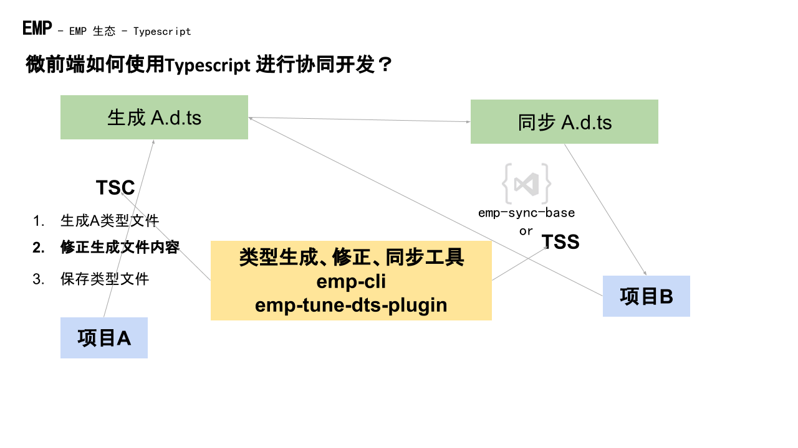

# @efox/emp-tune-dts-plugin

> 为 Module Federation 项目生成类型文件

[English](./README.md) | 简体中文

# 🧐 为什么
+ Typescript开发中，引用远程项目内容需要类型文件支撑。
+ tsc 所生成的模块类型是相对路径，不可被远程项目使用。
+ Module Federation issues: [How typesafe can a remote be with Typescript?](https://github.com/module-federation/module-federation-examples/issues/20)

# ✨ 特性
+ 生成一个含有项目所有类型的 d.ts 文件
+ 类型中带有当前项目名，并非相对路径
+ 形成类型闭环，生成到引用已完善
+ 支持自定义修改

# 😊 Example
### 当这个世界没有 emp-tune-dts-plugin 
直接执行 `tsc -d` 所生成的类型文件是相对路径的。


把该类型文件拉到子项目后，子项目并不能识别到该远程组件的类型，导致不能编译成功和类型提示。


### 当这个世界有了 emp-tune-dts-plugin 
执行 `yarn emp build --ts` 后会生成有当前项目名作为路径前缀的类型文件 index.d.ts。


把 emp-tune-dts-plugin  生成的类型文件拉到子项目，子项目不但可以识别到该远程组件的类型，而且编译成功和有类型提示。引用远程的组件、方法等等还有提示，有种微服务上的服务发现的感觉。


# 👨‍🔧 架构


## 📦 快速开始

`npm i @efox/emp-tune-dts-plugin` or `yarn add @efox/emp-tune-dts-plugin`

## 👨🏻‍💻 在 Webpack 上使用插件

```js
const { TuneDtsPlugin } = require('@efox/emp-tune-dts-plugin')
```

方式(1)(推荐)

```js
const createName = 'index.d.ts'
const createPath = './dist'
function operationDemo(fileData) {
  console.log(fileData)
  return fileData;
}
plugin.tunedts = {
  plugin: TuneDtsPlugin,
  args: [
      {
          output: path.join(createPath, createName),
          path: createPath,
          name: createName,
          isDefault:true,
          // 传入函数自定义操作
          operation: operationDemo
        },
  ],
};
```

方式(2)

```js
function operationDemo(fileData) {
  console.log(fileData)
  return fileData;
}
plugins: [
    new TuneDtsPlugin({
          output: path.join(createPath, createName),
          path: createPath,
          name: createName,
          isDefault:true,
          // 传入函数自定义操作
          operation: operationDemo
        })
]
```

参数解释：
| 参数名 | 类型 | 解释 |
| ---- | ---- | --- |
| output| string (必填)| d.ts 文件输出目录|
| path| string (必填)| d.ts 文件夹路径|
| name| string (必填)| d.ts 文件名|
| isDefault | boolean(必填) | 默认将相对路径替换为绝对路径 |
| operation| Function (选填)| 自定义操作 d.ts 文件函数（isDefault 为 true 时，operation 会继承 默认 Replace 后的内容）。入参为 d.ts 文件内容，操作完成后必须返回 d.ts 数据。 operationDemo 为例子|

## 💪 生成

+ 完成接入 Webpack Plugin 后，运行 Webpack 生成当前 Module Federation 项目的类型文件将保存在 dist

## 🔗 远程引用
### 方法1
`yarn add @efox/emp-cli`

`yarn emp tss 远程项目地址/index.d.ts -n 远程项目名.d.ts `

### 方法2
使用 VSCode 插件： [emp-sync-base](https://marketplace.visualstudio.com/items?itemName=Benny.emp-sync-base)
